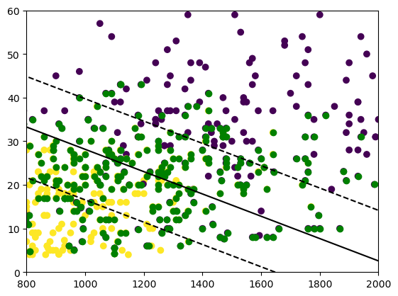
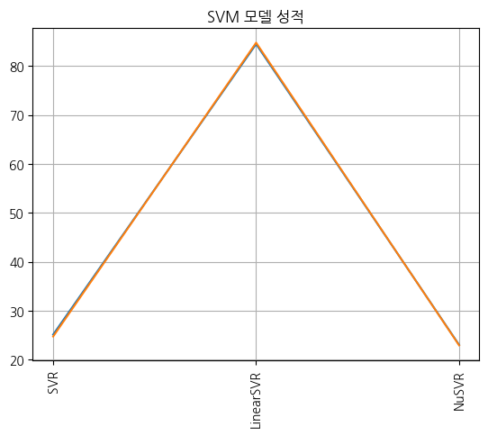
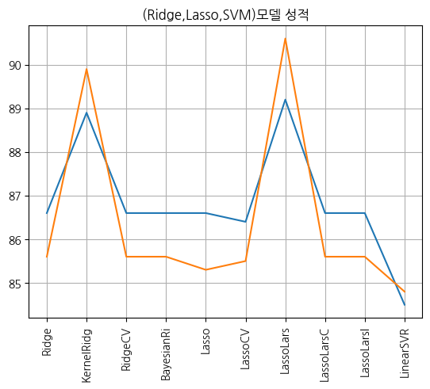
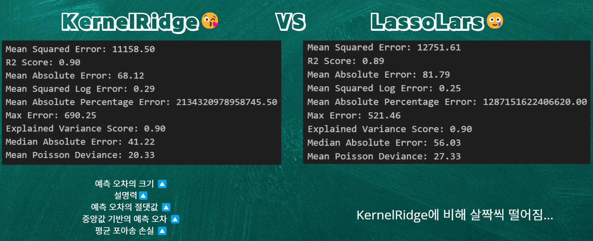

# _KDT05-Machine Learning Project_

경북대학교 KDT(Korea Digital Training) 빅데이터 전문가 양성과정 5기 : ML(Machine Learning) 3팀입니다

임소영 : [깃허브 링크](https://github.com/YimSoYoung1001)  
박희진 : [깃허브 링크](https://github.com/ParkHeeJin00)  
이승민 : [깃허브 링크](https://github.com/winmin94)  
명노아 : [깃허브 링크](https://github.com/noah2397)

  

#### 개발환경

| 패키지 이름  | 버전   | 사용 커맨드(Version command) |
| ------------ | ------ | ---------------------------- |
| Python       | 3.8.18 | python --version             |
| jupyter      | 1.0.0  | pip show jupyter             |
| ipython      | 8.12.2 | pip show ipython             |
| notebook     | 7.0.6  | pip show notebook            |
| numpy        | 1.24.3 | pip show numpy               |
| pandas       | 2.0.3  | pip show pandas              |
| matplotlib   | 3.7.2  | pip show matplotlib          |
| statsmodels  | 0.14.0 | pip show statsmodels         |
| skicit-learn | 1.3.0  | print(sklearn.**version**)   |

### KDT(Korea Digital Training)-ML(Machine Learning)

#### 사용한 데이터 사이트(수정 전)

1. [맥도날드](https://www.kaggle.com/datasets/mcdonalds/nutrition-facts)
2. [롯데리아](https://www.lotteeatz.com/upload/stg/etc/ria/items.html)
3. [미국 전 지점](https://www.kaggle.com/datasets/ulrikthygepedersen/fastfood-nutrition)
4. [버거킹](https://emilysinglelife.tistory.com/62)
5. [맘스터치](https://www.momstouch.co.kr/m/brand/notice-view.php?idx=49)
6. [노브랜드](https://realjace.tistory.com/entry/%EB%85%B8%EB%B8%8C%EB%9E%9C%EB%93%9C%EB%B2%84%EA%B1%B0-%EB%A9%94%EB%89%B4%EB%B3%84-%EC%B9%BC%EB%A1%9C%EB%A6%AC-%EC%98%81%EC%96%91%EC%84%B1%EB%B6%84-%EC%B4%9D%EC%A0%95%EB%A6%AC)  
   7.[프랭크 버거](https://rooftoper.tistory.com/entry/%ED%94%84%EB%9E%AD%ED%81%AC-%EB%B2%84%EA%B1%B0-%EC%98%81%EC%96%91%EC%84%B1%EB%B6%84)

### 주제 : 햄버거 영양 성분을 이용한 칼로리 예측 모델

- 목차

* 1. 주제 선정 배경
* 2. 전처리
* 3. 모델 분석(명노아 : Lasso, Ridge, SVM)
* 4. 모델 분석(이승민 : KNR, LR)
* 5. 모델 분석(임소영 : DT, Boosting)
* 6. 모델 분석(박희진 : Bagging, Voting)
* 7. 최종 산출물 시연
  

###### 역할 분담

|          역할 | 참여인원                       |
| ------------: | ------------------------------ |
|      주제선정 | 임소영, 박희진, 명노아, 이승민 |
|          코딩 | 임소영, 박희진, 명노아, 이승민 |
|          발표 | 임소영, 박희진, 명노아, 이승민 |
|       git관리 | 임소영, 박희진, 명노아, 이승민 |
|   Readme 작성 | 임소영, 박희진, 명노아, 이승민 |
|      PPT 제작 | 임소영, 박희진, 명노아, 이승민 |
| PPT 관리,병합 | 임소영, 박희진, 명노아, 이승민 |

### 소주제 개요(개인 항목)

  

    임소영(RandomForest와 Boosting을 활용한 데이터 분석)       
  

### DecisionTree         
**1. 데이터 전처리 실시**
- 데이터 전처리로 결측치, 중복값, 이상값 확인을 실시했습니다.
- 이상값 제거까지 실시했으나 과대적합의 문제점을 해결하기 위해 복원하였습니다.     

**2. 데이터셋 준비**
- 최고의 성능을 내는 random_state 값 구하기
- STD scaler를 활용한 스케일링 진행

**3. 학습 및 평가**             
- DecisionTree : 과대적합이 발생하여 튜닝 진행
- [ 튜닝1 ] DecisionTree + 파라미터 조정
- [ 튜닝2 ] DecisionTree + GridSearchCV          

**4. 예측값 구하기 및 성능 평가**
- 튜닝을 실시한 2가지 모델에 대해 예측값을 구하고 성능을 평가함
- 성능 평가 요소 (R2 score, MSE, MAE)

**5. 모델 저장 (.pkl 형식)**
- 둘 중 성능이 좋은 '튜닝1'모델을 최종 모델로 저장함

**6. Decision Tree 시각화**
- 저장된 모델에서 decision tree를 시각화 함            

### Boosting

**1. 데이터 전처리 실시**
- 데이터 전처리로 결측치, 중복값, 이상값 확인을 실시했습니다.
- 이상값 제거까지 실시했으나 과대적합의 문제점을 해결하기 위해 복원하였습니다.     

**2. 데이터셋 준비**
- 최고의 성능을 내는 random_state 값 구하기
- STD scaler를 활용한 스케일링 진행

**3. 학습 및 평가**             
- AdaBoostRegressor  |  GradientBoostingRegressor  |  HistGradientRegressor              
- 위 3가지 모델끼리 비교 하여 가장 점수차이가 적고 점수대가 높은 모델 채택함
- 앞서 만든 Decision tree 모델과 boosting 모델을 결합한 모델을 만들었음
- [모델1] GradientBoostingRegressor
- [모델2] Decision Tree + AdaBoostRegressor 
- [모델3] Decision Tree + AdaBoostRegressor + GridSearchCV

**4. 예측값 구하기 및 성능 평가**
- 위 3가지 모델에 대하여 예측값을 구해서 성능평가를 실시함
- 성능 평가 요소 (R2 score, MSE, MAE)

**5. 모델 저장 (.pkl 형식)**
- 셋 중 성능이 좋은 '모델2'를 최종 모델로 저장함

  

    명노아
  

# 0. 데이터 크롤링()

### 관련 파일 : 명노아/01_Crawling.ipynb

사용 데이터셋 :  
[맥도날드](https://www.kaggle.com/datasets/mcdonalds/nutrition-facts)  
[롯데리아](https://www.lotteeatz.com/upload/stg/etc/ria/items.html)  
[미국 전 지점](https://www.kaggle.com/datasets/ulrikthygepedersen/fastfood-nutrition)  
[버거킹](https://emilysinglelife.tistory.com/62)  
[맘스터치](https://www.momstouch.co.kr/m/brand/notice-view.php?idx=49)  
[노브랜드](https://realjace.tistory.com/entry/%EB%85%B8%EB%B8%8C%EB%9E%9C%EB%93%9C%EB%B2%84%EA%B1%B0-%EB%A9%94%EB%89%B4%EB%B3%84-%EC%B9%BC%EB%A1%9C%EB%A6%AC-%EC%98%81%EC%96%91%EC%84%B1%EB%B6%84-%EC%B4%9D%EC%A0%95%EB%A6%AC)  
[프랭크 버거](https://rooftoper.tistory.com/entry/%ED%94%84%EB%9E%AD%ED%81%AC-%EB%B2%84%EA%B1%B0-%EC%98%81%EC%96%91%EC%84%B1%EB%B6%84)

사용 모듈 : BeautifulSoup, urllib, pytesseract

# 1. 데이터 전처리

### 관련 파일 : 명노아/02_Preprocessing.ipynb

- 공통 feature, target 설정
- feature : 소금, 설탕, 지방, 단백질
- target : 칼로리

애로사항 : 맘스터치의 경우, 이미지 데이터로 있었는데 수작업이 여전히 필요하여 데이터셋에 합치지 않음
(moms_touch.png, moms_touch.txt)

# 2. 분석 파이프라인

- 1.  all_estimator로 회귀 모델 갖고오기
- 2.  Ridge, Lasso, SVM 모델 선별
- 3.  전처리 데이터 로드, 데이터 셋 분할(훈련용, 시험용)
- 4.  데이터 정규화
- 5.  이상값 제거(Z-score)
- 6.  데이터 분포, 상관계수 파악
- 7.  하이퍼 파라미터를 제외한 최적의 random_state 파악
- 8.  GridsearchCV를 사용하여 하이퍼 파라미터 찾기
- 9.  모델 데이터 파일 저장 (명노아/model)
- 10. 최종 산출물에 모델 파일 반영
  

# 3. Ridge, Lassso를 사용한 모델 분석

### 관련 파일 :

명노아/03_Ridge.ipynb,  
04_Lasso.ipynb,  
05_SVM.ipynb,  
06_SVM Visual.ipynb

사용한 머신러닝 모델

1. Ridge
2. KernelRidge
3. RidgeCV
4. BayesianRidge
5. Lasso
6. LassoCV
7. LassoLars
8. LassoLarsCV
9. SVR
10. 

# 4. 데이터 분석 결과 시각화

- 1. SVM 분류 기법으로 보았을 때, 일반적으로 햄버거 데이터가 제일 많겠지만 음료수나 감자튀김 추가 메뉴나 세트메뉴 등등...  
     => 이상치 값이 너무 많기에, 제대로 된 분류가 되지 않는 모습  
     
- 2. 왜 SVR 모델 중에서, LinearSVR은 높게 나왔는가?
     => 다차원 매핑을 시도하는 SVR, NuSVR과는 달리,직선을 긋는 LinearSVR은 상관관계가 높은 지방, 단백질에 초점을 잡아 정확률이 높게 나옴  
     
- 3. 전체 모델 성능 시각화
  => 01. KernelRidge : 다차원 공간에 매핑하면서도, 특정 계수의 가중치(계수)를 0으로 낮춤으로써 높은 정확률을 보임 : 비선형 관계를 갖는 데이터에 적합하다  
  => 02. LassoLars : 데이터의 일부분만 사용하고, 계수의 축소 경로를 제공하므로, 정규화 강도를 조절하면서 모델을 세밀하게 튜닝할 수 있다  
  
  

# 5. 결론

- KernelRidge를 제일 성능이 좋은 모델로 확정

  

    이승민(소주제)
  

  

    박희진(앙상블 - 배깅(RandomForest) / 보팅(Voting) )
  

  
## (1) 모델 선정 이유
  
- 과대적합때문에 늘 고생했던 경험이 있어서 과대적합을 완화해주는데 알맞은 RandomForest 모델을 선정하였다.
- 우리 프로젝트가 같은 데이터로 다른 모델의 성능을 비교 파악 하는 것이기 때문에 보팅의 알고리즘과 매우 유사하다고 느꼈고, 우리가 비교해서 가장 높은 성능을 가진 모델의 결과와 보팅모델의 결과를 비교해보면 재밌겠다는 생각이 들어 선정하였다.
  
## (2) 데이터 파악 및 전처리
  
- data : restrant, item, sodium, sugar, total_fat, portein, calories
- target : calories
- feature : item, sodium, sugar, total_fat, portein
- restrant는 순서가 없는 범주형 데이터 -> OneHotEncoding 실시
  - 같은 브랜드지만 다른 이름인 데이터가 있길래 통일
  - targer과 상관계수 파악 -> 큰 상관관계 파악 X -> 무시 
- 결측치 제거
    - 대체했을 때, 데이터가 왜곡될까봐 대체하지 않고 제거
- 중복치 제거
- 이상치 확인
  
    - 이상치가 매우 많이 확인 되었으나 잘못 입력된 데이터가 아니라는 판단하에 제거하지 않고 진행
    - 이상치에 영향을 덜 받는 MinMaxScaler나 RobustScaler 사용하는 것이 좋겠다고 판단
- feature data를 산점도 찍어 봤을때, 선형 또는 묘하게 2차 곡선을 띰
  
  - feature들끼리 상관관계 있는지 파악
    - total_fat과 sodium 상관관계 높음
    - total_fat과 sodium feature만 poly 진행하여 모델 학습해봤으나 과대적합되어 기각
- MinMaxScaler 적용하여 스케일링
  - MAE와 RMSE가 제일 낮은 Scaler인 MinMaxScaler 선택
  - 이상치에도 둔감하기 때문에 알맞다고 생각됨
- train_test_split 메서드의 최적의 random_state 값 찾기
- RandomForest 메서드의 최적의 random_state 값 찾기
  
  
## (3) 모델 학습 및 모델 평가  
  
### __[ RandomForest model ]__  
  
- train_score : 0.98 / test_score : 0.95 -> 과대적합이라고 판단
  -  과대적합을 방지하기 위해 튜닝 진행
    - n_estimators, max_depth, min_samples_split, max_features 파라미터 튜닝
  - 과대적합을 방지하기 위해 교차검증 진행
    - GridSearchCV를 통해 최적의 모델 산출
** 과대 적합 해결! ** 
- 튜닝 후 : train_score : 0.96 / test_score : 0.95 -> 최적적합
  
<aside>
💡 최적의 모델  
  
    
      
  

</aside>
  
### __[ Voting model ]__  
  
- 각 조원들과 내가 만들었던 최적의 모델을 estimators 파라미터 안에 넣어 모델 생성 및 학습
- train_score : 0.91 / test_score : 0.91 -> 최적적합
  
<aside>
💡 최적의 모델  

    
              
  

</aside>
  
## (4) 새로운 데이터로 칼로리 예측  
- 맘스터치 화이트갈릭싸이버거의 나트륨, 당류, 포화지방, 단백질 데이터를 model에 넣어 predict하여 값 예측  
- 각 모델 별로 예측값과 오차 도출
  
  
## (5) 결과  
  

- 해당 데이터에서는 boosting model이 가장 적합하다.
   - boost model이 score가 가장 높고, 최적적합에다, 새로운 데이터를 넣었을때도 MAE와 RMSE값이 낮다.  
  
## (6) 활용
- 칼로리 예측을 기반한 햄버거 추천 프로그램  
  

## (7) 피드백  
  
- 이상치가 많은 feature data에서 MinMaxScaler를 잘 사용하였다.
  - 이상치 제거를 안해도 MinMaxScaler로도 어느정도 이상치 정리가 된다.  

